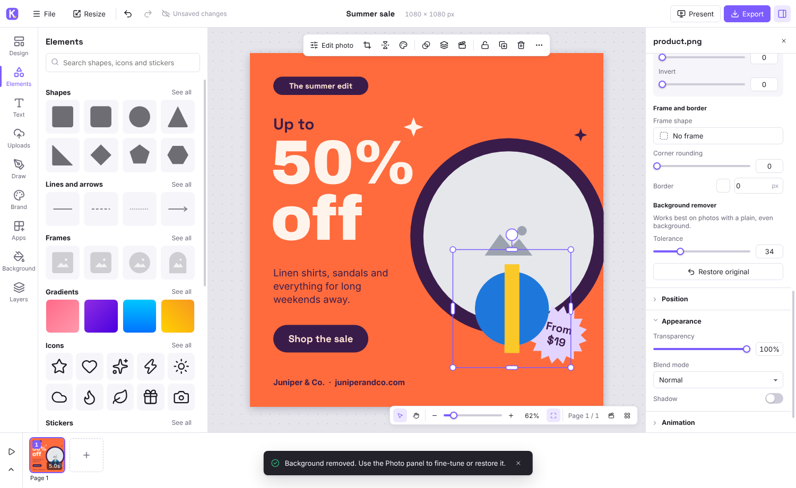

# Kamva

Kamva is a desktop editor for graphics, photos, video and audio. You lay out designs on a canvas, edit photos, build multi-page presentations and short videos, and export to every common format. It runs fully offline on Windows, macOS and Linux.



## Download

Get the latest Windows build from the [Releases page](https://github.com/terpenesalad/kamva/releases):

- **Kamva-Setup-x.y.z.exe**: installer, which adds Start menu and desktop shortcuts and opens `.kamva` files
- **Kamva-x.y.z-portable.exe**: single file, no install needed

The builds aren't code-signed yet. Windows SmartScreen may show "Windows protected your PC" the first time. Choose **More info → Run anyway**.

## What it does

### Design
- Multi-page designs at any size, in px, in, mm or cm. There are 32 presets for social posts, video, presentations and print.
- 32 built-in templates, plus your own saved templates.
- Text with 40 bundled fonts, uploaded fonts (TTF/OTF/WOFF) and installed system fonts. Effects include outline, hollow, highlight, glow, lift, echo, neon and splice, plus curved text, lists, letter spacing and line height.
- 35 shapes, lines with arrowheads, about 1,900 icons, emoji stickers, charts (bar, column, line, area, pie, donut, progress), tables and QR codes.
- Photo frames: mask any photo to a circle, arch, blob, star, heart and more. Drop a photo onto a frame to fill it.
- Freehand drawing with pen, marker and highlighter.
- Gradients (linear and radial) everywhere, an eyedropper, document and brand colour palettes.
- Snapping to the page, other objects, guides and grid. Rulers, draggable guides, margins and print bleed.
- Grouping, locking, layers, alignment and distribution, copy and paste, copy style, and unlimited undo.
- Brand kits with colours, palettes, heading/subheading/body fonts and logos. "Apply brand to this design" restyles a design in one step.

### Photo editing
- Crop with handles, a rule-of-thirds overlay and drag-to-reposition.
- 23 filters with adjustable intensity.
- Adjustments: brightness, contrast, highlights, shadows, saturation, temperature, tint, hue, sharpen, blur, grain, vignette, sepia, grayscale and invert.
- Background remover, with tolerance control and restore original.
- Corner rounding, borders, shadows, blend modes, transparency and flip.

### Video and audio
- A timeline with page durations, 13 page transitions, and enter/exit/loop animations for every element.
- Video clips with trim, speed, volume, mute and loop. Video can also be used as a page background.
- Audio tracks on multiple lanes with waveforms, trim, move, split, volume and fade in/out.
- Voice-over recording from your microphone.
- Full-screen presenter with autoplay.

### Import
Images (PNG, JPG, WebP, GIF, SVG, BMP, AVIF), video (MP4, WebM, MOV, MKV, AVI; anything the built-in engine can't play is converted automatically), audio (MP3, WAV, OGG, M4A, AAC, FLAC, Opus), fonts, PDF (each page becomes a page) and `.kamva` projects. Drag files in, paste images from the clipboard, or use **File → Import**.

### Export
| Format | Notes |
| --- | --- |
| PNG, JPG, WebP | 0.5×–4× or custom size, transparent background, selected elements only, multi-page to a folder or ZIP |
| SVG | Real vectors with embedded fonts |
| PDF | Standard or print quality (300 dpi), multi-page |
| MP4, WebM | Animations, transitions, video clips and a mixed soundtrack, 24/30/60 fps, up to 4K |
| GIF | Looping animation |
| WAV, MP3 | The mixed soundtrack |
| .kamva | Editable project with all media embedded |

### Customisation
Light, dark or system theme, accent colour, interface size, canvas backdrop, default units, snapping and grid, nudge distances, autosave interval, default frame rate and page length. Your designs autosave to a library on the Home screen.

## Keyboard shortcuts

Press **Ctrl+/** in the app for the full list. The essentials:

| Action | Shortcut |
| --- | --- |
| Undo / redo | Ctrl+Z / Ctrl+Shift+Z |
| Duplicate | Ctrl+D |
| Group / ungroup | Ctrl+G / Ctrl+Shift+G |
| Add text / rectangle / circle / line | T / R / C / L |
| Draw / hand / select | D / H / V |
| Pan | Hold Space and drag |
| Zoom | Ctrl+scroll, Ctrl+= / Ctrl+-, Ctrl+0 to fit |
| Play / pause | K |
| Export | Ctrl+E |

## Building from source

Requires Node.js 20+.

```bash
npm install
npm run dev          # run the app with hot reload
npm run build        # typecheck and build
npm run fetch:ffmpeg -- win32 x64   # download FFmpeg for the target platform
npm run dist:win     # Windows installer + portable exe in release/
```

Building the Windows installer on Linux needs Wine with 32-bit support. Pushing a `v*` tag runs the GitHub Actions workflow, which builds Windows, macOS and Linux and attaches the files to a release.

### Project layout

```
electron/          main process: windows, menus, file dialogs, FFmpeg encoding
src/types.ts       the document model
src/store/         editor state (undo/redo) and UI/preferences state
src/lib/render/    scene builder shared by the editor, presenter and exporters
src/lib/export/    PNG/JPG/WebP/SVG/PDF/MP4/WebM/GIF/audio exporters
src/lib/templates/ built-in templates
src/editor/        canvas controller, panels, inspector, timeline, dialogs
src/home/          home screen
```

## Licence

MIT. FFmpeg is bundled as a separate program under the GPL v3 (see `resources/ffmpeg/`). The fonts are from Fontsource (SIL Open Font License) and the icons are from Lucide (ISC).
